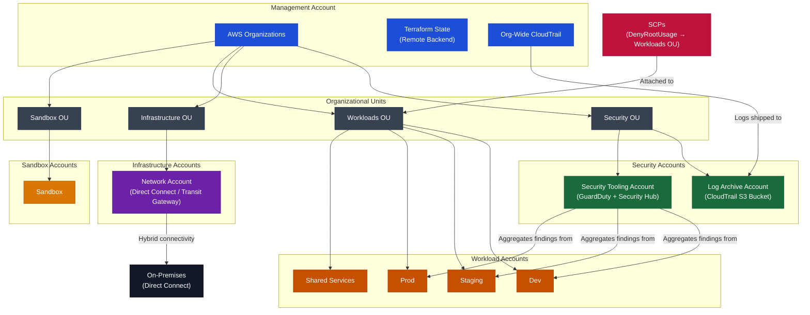

# AWS Enterprise Landing Zone Bootstrap

A hybrid, multi-account AWS landing zone designed with the AWS Well-Architected Framework. Includes centralized governance via AWS Organizations, Service Control Policies, automated account provisioning, org-wide CloudTrail logging, centralized security controls, and Direct Connect integration — all built with Terraform.

## Overview

The goal is to provide a secure, scalable, and auditable foundation for enterprise AWS environments — one that enforces guardrails automatically and gives teams isolated, production-ready accounts without starting from scratch every time.

Most organizations build AWS environments account by account, bolting on security controls after the fact. This architecture flips that: governance, security, and structure are built in from day one.

### High-Level Architecture

Think of this like building a city before anyone moves in.

* AWS Organizations is the city government — it defines the districts (OUs) and who lives where
* Accounts are the buildings — isolated, purpose-built, and assigned to the right district
* SCPs are the zoning laws — they enforce what can and can't happen, regardless of who's in charge of a building

**Terraform is the blueprint — everything is reproducible, version-controlled, and auditable.**

### This design ensures:

* Workloads are isolated by environment (dev, staging, prod) and function (security, network, shared services)
* Security controls are enforced at the organizational level — not dependent on individual account owners
* No single team can accidentally (or intentionally) bypass guardrails like root account usage
* Audit logs are captured org-wide and centralized automatically

## Core Components

**1. AWS Organizations & Organizational Units**

The foundation of the multi-account structure. Four OUs provide clear separation of concern:

* `Security` — Log Archive and Security Tooling accounts live here
* `Infrastructure` — Network account for shared connectivity
* `Workloads` — Dev, Staging, and Prod accounts for application environments
* `Sandbox` — Isolated experimentation with no access to production

**2. Account Factory (Automated Provisioning)**

Accounts are provisioned programmatically via Terraform — no manual console clicks. Each account is:

* Assigned to the correct OU automatically
* Given a unique, purpose-specific email
* Ready to inherit org-level SCPs and CloudTrail from day one

**3. Service Control Policies (SCPs)**

SCPs act as org-wide guardrails that cannot be overridden by any account, even by account admins. Current policies:

* `DenyRootUsage` — Blocks root account activity across all Workload accounts, enforcing least-privilege at the organizational level

SCPs are managed as JSON in version control, making policy changes reviewable and auditable.

**4. Centralized CloudTrail**

A single org-wide CloudTrail trail captures all API activity across every account and ships logs to a centralized S3 bucket in the Log Archive account. This ensures:

* No account can disable logging for itself
* All audit logs are stored in a dedicated, locked-down account
* Compliance and forensics have a single source of truth

**5. Centralized Security Controls**

The security module provisions GuardDuty and Security Hub across the organization, delegating administration to the Security Tooling account. This provides:

* Threat detection across all accounts from a single pane of glass
* Centralized findings aggregation
* No dependency on workload account owners to manage their own security posture

**6. Terraform (Infrastructure as Code)**

Every account, policy, and control is defined in reusable Terraform modules. Benefits:

* Full reproducibility — tear down and rebuild the entire org from a single `terraform apply`
* Version control — every change is tracked, reviewable, and reversible
* Reduced human error — no manual console configuration
* Modular structure — each capability is independently deployable and testable

## Why This Matters

Cloud environments without a landing zone accumulate technical debt fast. Teams create accounts ad hoc, logging gets skipped, root accounts go unprotected, and security becomes a cleanup project instead of a foundation. This architecture prevents that pattern entirely — security, isolation, and governance are the starting point, not an afterthought.

## Well-Architected Framework

**Security**
* Root account usage blocked via SCP across all Workload OUs
* Security controls centralized and managed from a dedicated Security Tooling account
* Audit logs isolated in a separate Log Archive account — no workload can tamper with them

**Operational Excellence**
* No manual account creation — Terraform handles provisioning end to end
* SCPs managed as code — policies are reviewable and consistent
* Modular structure makes it easy to add new accounts or OUs without touching existing config

**Reliability**
* Org-level controls apply automatically to new accounts — no configuration gaps as the org grows
* CloudTrail runs at the org level — no dependency on per-account setup

**Performance Efficiency**
* Shared services and network accounts prevent duplicated infrastructure across workloads
* Teams get production-ready accounts without building from scratch

**Cost Optimization**
* Centralized logging eliminates redundant CloudTrail trails per account
* IaC prevents configuration drift and the hidden costs that come with it
* Sandbox OU isolates experimentation costs from production spending

**Sustainability**
* New OUs, accounts, and SCPs can be added without downtime or manual intervention
* Modular Terraform design allows controlled, incremental expansion

## Files

* `main.tf` — Root module orchestrating all components: organization, accounts, SCPs, CloudTrail, and security
* `providers.tf` — AWS provider configuration including cross-account provider aliases for security delegation
* `backend.tf` — Remote state configuration for shared, consistent state management
* `variables.tf` — Input variables for environment-specific values
* `outputs.tf` — Output values for cross-module and cross-account references
* `.gitignore` — Excludes sensitive files (`.tfvars`, local state) from version control
* `modules/organization` — Creates the AWS Organization and all Organizational Units
* `modules/accounts` — Provisions and assigns all member accounts to their respective OUs
* `modules/scps` — Manages SCP content and attachment to OUs
* `modules/cloudtrail` — Deploys org-wide CloudTrail with centralized S3 logging
* `modules/security` — Configures GuardDuty and Security Hub with delegated admin to Security Tooling account
* `scps/` — JSON policy documents for all Service Control Policies

## Prerequisites

* AWS Organizations enabled on the management account
* Terraform >= 1.0
* AWS CLI configured with management account credentials
* A dedicated email address per account (or email aliasing configured)

## Deployment

1. Initialize Terraform:

```
terraform init
```

2. Review the plan:

```
terraform plan
```

3. Deploy:

```
terraform apply
```

## Cleanup

Remove all resources:

```
terraform destroy
```

> ⚠️ Note: Destroying an AWS Organization requires all member accounts to be removed first. Ensure accounts are properly closed before running destroy in a real environment.

## Architecture Diagram


